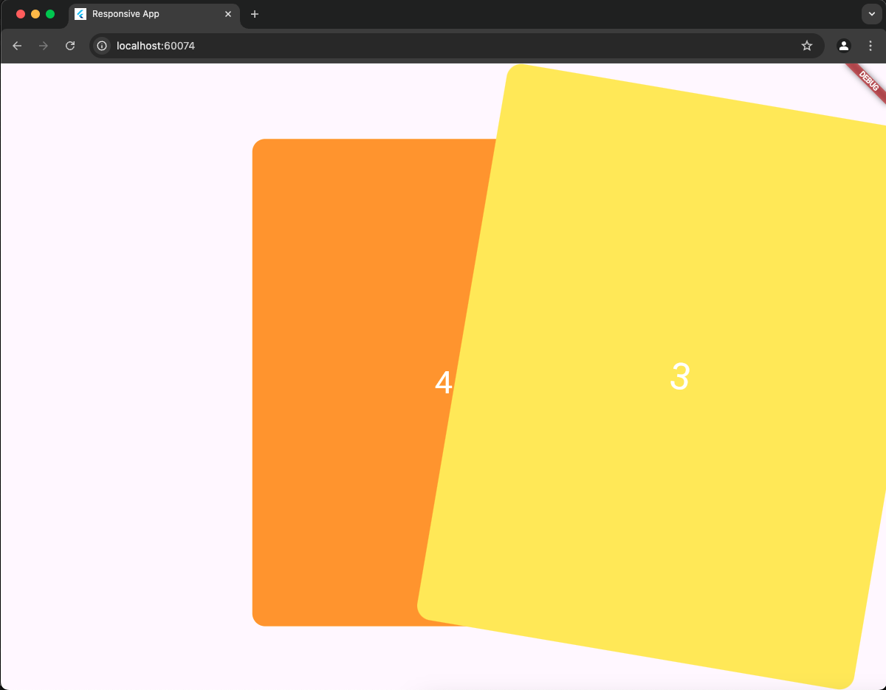
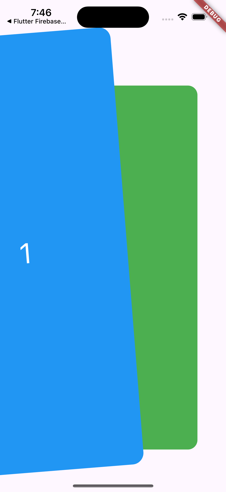

# Swiper Package

`swiper` es una librería Flutter diseñada para implementar animaciones de swipe responsivas y altamente personalizables. Este paquete permite crear carruseles o swipers de tarjetas que se adapten a diferentes tamaños de pantalla y dispositivos, asegurando una experiencia de usuario fluida y atractiva.

## Imágenes del Proyecto

Aquí puedes ver algunas capturas de pantalla del proyecto en funcionamiento:

- 
- 

## Objetivo

El objetivo de este paquete es proporcionar una solución modular para la creación de swipers de tarjetas en Flutter, con animaciones personalizadas y un enfoque en el diseño responsivo. Esto permite su integración en cualquier proyecto Flutter que requiera una funcionalidad de swipe de alta calidad.

## Características

- **Animaciones Personalizadas**: Ofrece una amplia gama de opciones para personalizar las transiciones de swipe, permitiendo un control total sobre la experiencia del usuario.
- **Diseño Responsivo**: Se adapta automáticamente a diferentes resoluciones y tamaños de pantalla, optimizando el diseño para cada dispositivo.
- **Fácil Integración**: Al ser un paquete independiente, `swiper` puede integrarse fácilmente en cualquier proyecto Flutter.

## Uso

### Instalación

Para usar el paquete `swiper`, añade la dependencia en el archivo `pubspec.yaml` de tu proyecto:

```yaml
dependencies:
  flutter:
    sdk: flutter
  swiper:
    path: packages/swiper
```
